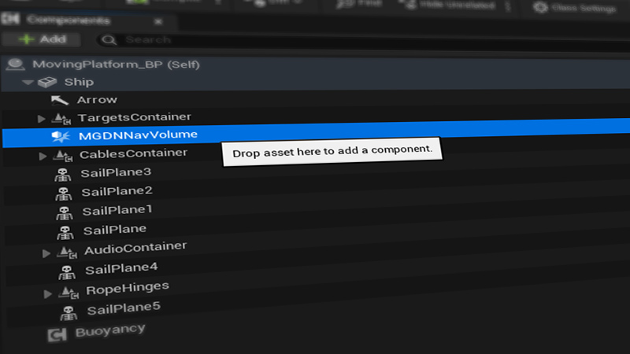
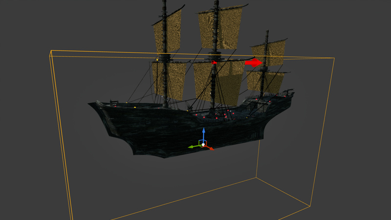
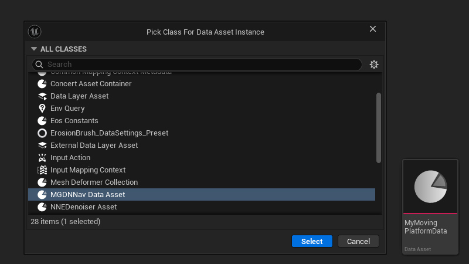
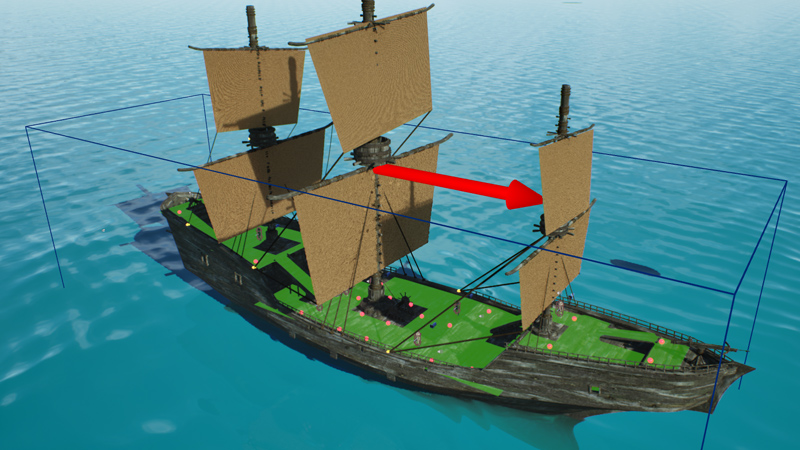
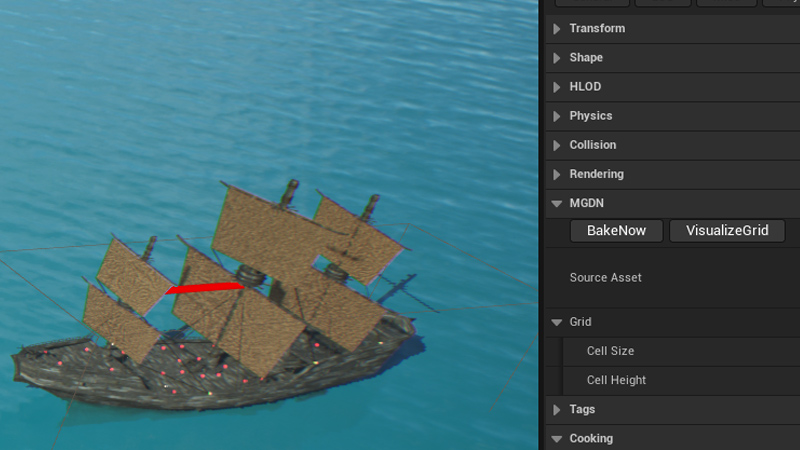
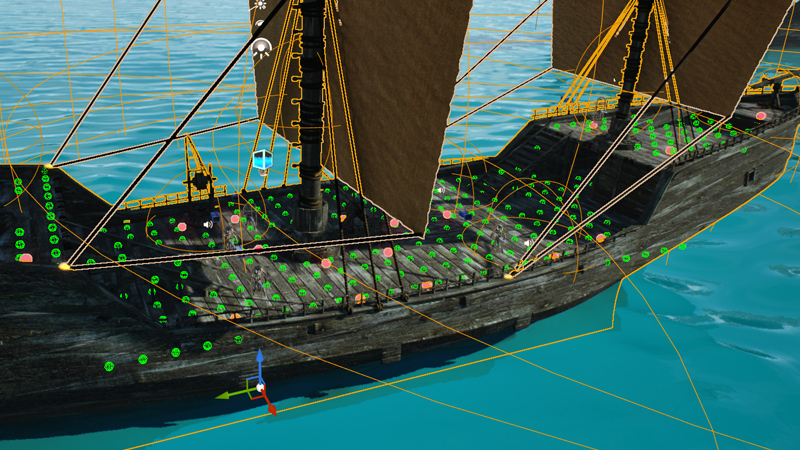
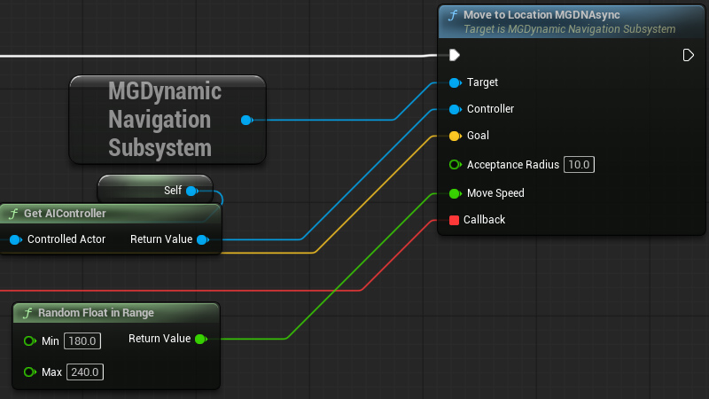
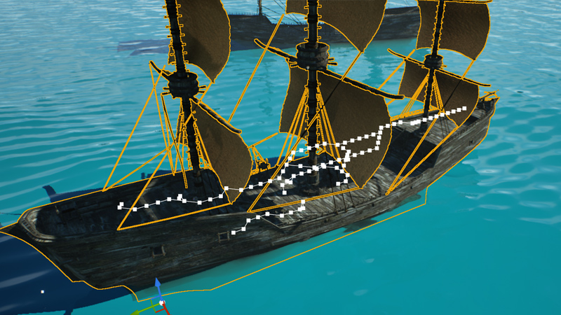
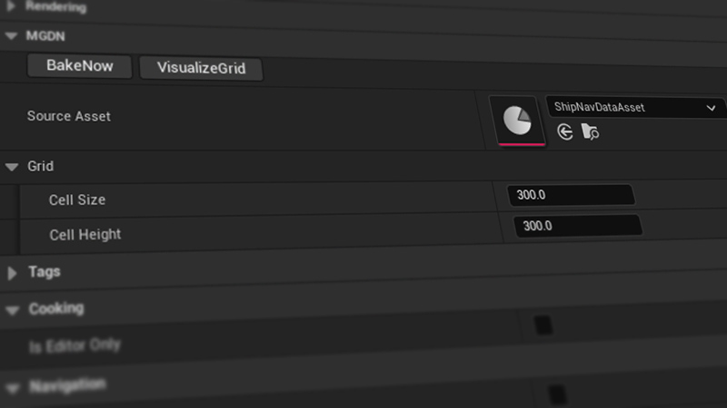

# MG Dynamic Navigation Plugin

## Overview

**MG Dynamic Navigation (MGDN)** is an Unreal Engine plugin that gives AI the ability to move reliably on **moving platforms**, such as ships, elevators, floating islands, physics-driven actors, and multi-deck structures.

Instead of relying on the static Recast NavMesh, MGDN dynamically builds a **local 3D voxel navigation grid**, detects walkable areas using raycasts, and runs a custom **A\*** solver to generate paths.  
AI movement is handled through smooth local-space spline motion, unaffected by platform rotation, acceleration, or physics simulation.

Typical use cases:
- AI movement on large ships with multiple decks
- AI walking on rotating/tilting platforms
- Physics-driven moving platforms
- Complex ship layouts with ramps, slopes, and multi-layer geometry

If you encounter any issues, please open a GitHub issue.  
If you'd like to contribute, feel free to create a pull request.

## Features

- Dynamic **3D voxel grid** generation per moving actor
- Works on **any moving/physics actor** (ships, elevators, rigs, etc.)
- Local-space **A\*** pathfinding
- Support for **ramps, slopes, multi-deck layouts**
- Spline-based movement with smoothing and rotation interpolation
- Grid visualization tools
- Fully Blueprint-callable movement functions
- No dependency on UE’s built-in NavMesh

## Examples
|    |     |
|:-------------------------------------------------:|:--------------------------------------------------:|
| Navmesh data point generations and visualization. | Multi-deck navigation paths and spline components. |

|   |
|:------------------------------------------------:|
| Dynamic navigation on a physics-driven platform. |

## Installation

Install the plugin like any other Unreal Engine plugin:

- Place the plugin under:  
  `YourProject/Plugins/MGDynamicNavigation`
- Enable the plugin in the Unreal Editor
- Add the **MGDNNavVolume** actor to your moving platform
- Assign or create a **MGDNNavDataAsset**
- Click **Bake Grid**

## Quick Start

After you enabled the plugin,
1. Add **MGDN Nav Volume** component to your moving platform.
# 
2. Adjust the **volume size** to cover walkable areas.
# 
3. Create a new **MGDNNavDataAsset** and assign it to the component.
# 
4. Place your moving platform in the scene.Make sure you have a **NavMesh** on your scene and walkable geometry is present and ready for navigation.
# 
5. Press Btn **Bake Grid** optionally adjust cell sizes to match your needs.to generate the voxel grid. This may take a few seconds depending on the geometry size. This simply uses the NavMesh to generate the voxel grid into a data asset.
# 
6. Press visualize grid button to see the voxel grid.
# 
7. Use MGDN movement functions to move the ai or any controller over the platform.
# 
8. MGDN movement functions are available in C++ and Blueprint and uses dynamical pathfinding creating splines over the voxel grid uneffected by platform rotation, speed, movement or any other factors enabling.
# 

## How It Works

- A **Nav Volume Component** defines a 3D bounding box around a moving platform (ship, elevator, vehicle, etc.).
- When you press **Bake**, the plugin:
  - Divides the volume into a 3D voxel grid.
  - Line traces each voxel against the Unreal NavMesh.
  - Marks voxels as **walkable / not walkable** and stores them in a data asset.
- During gameplay, the runtime system:
  - Detects which platform the AI is currently standing on.
  - Converts world-space positions to **platform-local coordinates**.
  - Performs **3D A* pathfinding** on the voxel grid.
  - Outputs a sequence of grid points that form a valid path.
- A spline is generated locally on the platform:
  - Spline moves *with* the platform (no drifting).
  - AI follows the spline smoothly with rotation and interpolation.
- Physics interactions are suppressed during movement to avoid pushing or destabilizing the platform.
- When AI reaches the goal:
  - Spline is destroyed.
  - Physics/collision is restored.
  - Callback event fires.

# 

### MGDN Nav Volume Component

- Defines the scanning bounds
- Generates voxel grid from geometry & navmesh
- Stores baked results in **MGDNNavDataAsset**
- Provides debug visualization tools

#### Parameters

- **Cell Size** – Horizontal voxel resolution
- **Cell Height** – Vertical voxel slice resolution
- **Source Asset** – Assigned nav data asset
- **Visualize Grid** – Shows walkable voxels
- **Bake Now** – Regenerates grid

### MGDynamicNavigationSubsystem

- Manages all MGDN volumes in the world
- Handles AI movement updates
- Provides async pathfinding interface
- Allows querying paths in C++ or Blueprint

## Movement System

MGDN moves AI using:
- Local-space spline path
- Smooth interpolation
- Directional rotation
- Optional velocity injection for animation playback

Movement remains stable even if the ship tilts or rotates.

## Technical Notes (Important)

MG Dynamic Navigation (MGDN) is a **technical proof-of-concept (TPOC)** that demonstrates how to build
a localized navigation system on top of Unreal's standard NavMesh.  
It is designed to solve navigation on **moving platforms** such as ships, elevators, transports, dynamic floors,
and other actors that reposition or rotate in the world.

MGDN combines two systems:

1. **Unreal Engine NavMesh sampling**  
   During baking, MGDN reads the UE NavMesh inside the volume using line traces.  
   This gives accurate walkable data for any dynamic platform surface.

2. **Localized grid + custom movement**  
   Navigation is solved in *platform-local space* using a 3D voxel grid and A* pathfinding.  
   AI follows this path via a spline that moves with the platform.

> This approach ensures the AI stays correctly aligned with the platform without drifting.

### Extensibility / Customization

Because MGDN is a TPOC, the movement layer is intentionally minimal.  
Depending on your game's movement rules, you may extend or customize the following:

- **C++ movement injection**  
  MGDN uses a lightweight XY interpolation + spline following.  
  You can replace this with custom character movement logic, root motion, or your own animation-driven locomotion.

- **Spline generation**  
  You can modify spline smoothing, point interpolation, or generate curved/bezier paths instead of linear grid paths.

- **Onboarding / Offboarding between systems**  
  MGDN does *not* currently implement transitions between:
  - Unreal’s native NavMesh navigation, and
  - MGDN’s localized navigation on moving platforms.

  If your game requires AI to walk from the world onto the platform (or vice-versa), you will need to implement a custom handover:
  - Detect approach distance to platform
  - Switch from UE navigation → MGDN navigation
  - Or reverse when leaving the platform

These features are intentionally left open so each project can implement the best solution for its gameplay style.

### Summary

MGDN is a flexible base system that:

✔ Bakes local walkable data on moving platforms  
✔ Performs 3D grid pathfinding in local space  
✔ Moves AI with splines that follow the platform  
✔ Allows developers to expand movement logic however they want

But it does *not* impose a single complete game-ready solution.

This keeps the plugin lightweight, extensible, and easy to adapt to different project needs.

## FAQ

<b>Can MGDN handle multiple decks?</b>

> Yes. The voxel grid supports full 3D navigation with multiple height layers.

<b>Does it work with physics-driven platforms?</b>

> Yes. Movement is relative to the platform’s transform every frame.

<b>Is Unreal’s NavMesh required?</b>

> No. MGDN works entirely without UE NavMesh.

<b>How do I debug walkable nodes?</b>

> Use the **Visualize Grid** button inside MGDN Nav Volume.

## Known Limitations / Tips

- Extremely thin geometry requires smaller cell size
- Path smoothing depends on grid density
- Physics collisions on AI may affect the platform
- Avoid tiny cell heights unless necessary

## License

This plugin is under the [MIT License](LICENSE).  
Commercial use is allowed as long as the copyright notice is included.

## *Support Me*

If you like the plugin, you can support development with a coffee:

